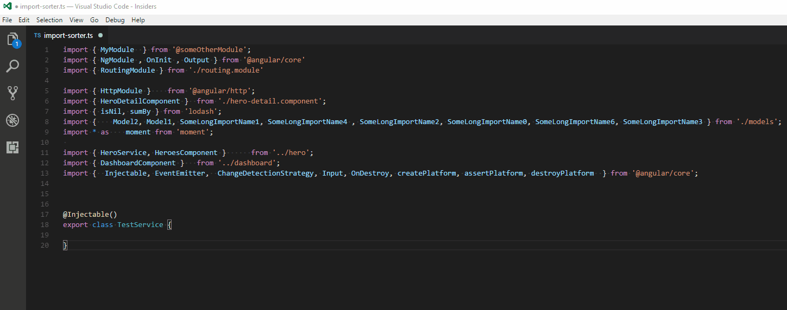

# import-sorter
Extension which sorts TypeScript imports according to the configuration provided. The configuration defaults follow ESLint sort-imports rules.
Configuration supports regex functions to set sorting priority and rules

## Examples


## Features
For now sorting supports only typescript language.

## Command
To run the sorter use `Sort Imports` command from the `Command Palette` (Ctrl+Shift+P).

Alternatively, you can set `importSorter.generalConfiguration.sortOnBeforeSave` to `true`, which would
trigger sorting before each save operation.

Also you could use/redefine keybindings. The default one is `ctrl + alt + o`.

## Extension Settings
an example of default configuration is provided bellow. For available options have a look at vs code settings(it should show available settings when you search for importSorter)
```json
  // Default file configuration name
  "importSorter.generalConfiguration.configurationFilePath": "./import-sorter.json",

  // Excludes sorting for files which match given regex expression. Regex considers the whole file path. The file path separator is normalized to /
  "importSorter.generalConfiguration.exclude": [],

  // Enables sort before each save of the document
  "importSorter.generalConfiguration.sortOnBeforeSave": false,

  // If true then the import string has a semicolon at the end, otherwise it will not be appended. Default is true
  "importSorter.importStringConfiguration.hasSemicolon": true,

  // The count of units before import is new-lined
  "importSorter.importStringConfiguration.maximumNumberOfImportExpressionsPerLine.count": 100,

  // The type of length restriction, before import is moved to a new line
  "importSorter.importStringConfiguration.maximumNumberOfImportExpressionsPerLine.type": "maxLineLength",

  // The number of new lines after the last sorted import
  "importSorter.importStringConfiguration.numberOfEmptyLinesAfterAllImports": 1,

  // The path quotes
  "importSorter.importStringConfiguration.quoteMark": "single",

  // Number of spaces after comma
  "importSorter.importStringConfiguration.spacingPerImportExpression.afterComma": 1,

  // Number of spaces after {
  "importSorter.importStringConfiguration.spacingPerImportExpression.afterStartingBracket": 1,

  // Number of spaces before comma
  "importSorter.importStringConfiguration.spacingPerImportExpression.beforeComma": 0,

  // Number of spaces before }
  "importSorter.importStringConfiguration.spacingPerImportExpression.beforeEndingBracket": 1,

  // Left number of spaces for the new lined imports. If tabType is set to 'tab', then the configuration defines the size of the tab in number of spaces
  "importSorter.importStringConfiguration.tabSize": 4,

  // Defines the character which will be printed on each new lined import expression
  "importSorter.importStringConfiguration.tabType": "space",

  // If always/multiLine then adds a trailing comma at the end of the imports for 'single and multi' and 'multi-line' imports respectively. Default is none therefore no trailing comma
  "importSorter.importStringConfiguration.trailingComma": "none",

  // The default number of empty lines after any group. This has lesser priority then empty lines in rules
  "importSorter.sortConfiguration.customOrderingRules.defaultNumberOfEmptyLinesAfterGroup": 1,

  // The default order level of everything which is not included into rules
  "importSorter.sortConfiguration.customOrderingRules.defaultOrderLevel": 20,

  // Disable sorting of path on the default group
  "importSorter.sortConfiguration.customOrderingRules.disableDefaultOrderSort": false,

  // The default order level of everything which is not included into rules
  "importSorter.sortConfiguration.customOrderingRules.rules": [
        {
            "type": "importMember",
            "regex": "^$",
            "orderLevel": 10,
            "disableSort": true
        },
        {
            "regex": "^[@]",
            "orderLevel": 30
        },
        {
            "regex": "^[.]",
            "orderLevel": 40
        }
  ],

  // Sort Direction of names in curly brackets
  "importSorter.sortConfiguration.importMembers.direction": "asc",

  // Sort Order of names in curly brackets
  "importSorter.sortConfiguration.importMembers.order": "caseInsensitive",

  // Sort Direction of paths
  "importSorter.sortConfiguration.importPaths.direction": "asc",

  // Sort Order of paths
  "importSorter.sortConfiguration.importPaths.order": "caseInsensitive",

  // Combine imports with the same path
  "importSorter.sortConfiguration.joinImportPaths": true
```
## Some settings in more details:
- `importSorter.generalConfiguration.configurationFilePath` adds an option to read configuration from file. The setting represents a relative path to the root of the open vscode workspace.
The default value is `./import-sorter.json`. Bellow is a example of the configuration:
```json
    {
      "importStringConfiguration": {
        "trailingComma": "multiLine",
        "tabSize": 4,
        "maximumNumberOfImportExpressionsPerLine": {
          "count": 50
        }
      },
      "sortConfiguration": {
        "customOrderingRules": {
          "defaultNumberOfEmptyLinesAfterGroup": 2
        }
      }
    }
```
The priority of settings is given to the configuration file. If the setting does not exist in the configuration file then the value of the vscode setting will be taken. If file does not exist, then all settings will be taken from vscode.
******
- `importSorter.generalConfiguration.exclude` represents an array of regex expressions to match agaist full file paths. If matched, then the file will be excluded from sorting.
The default value is `[]`. Bellow is a example of the configuration:
```json
    {
      "generalConfiguration": {
        "exclude": [
          ".*polyfill\\.ts"
        ]
      }
    }
```
In the example, any path which finishes with `pollyfill.ts` path will be excluded.
******
-  `importSorter.sortConfiguration.customOrderingRules.rules` is a json array of regex expressions which sets the sort group order.
As of now the default setting is
```json
[
    {
        "type": "importMember",
        "regex": "^$",
        "orderLevel": 10,
        "disableSort": true
    },
    {
        "regex": "^[@]",
        "orderLevel": 30
    },
    {
        "regex": "^[.]",
        "orderLevel": 40
    }
]
```
The `type` is an optional and defaults to `path`(another value is `importMember`). That setting says that we make any import which does not have `from` keyword `(possibly an import with side effect)` to have the highest order priority of `10`. The highest priority given to the lowest number. We also say that we do not want to apply sorting rules to that group of `disableSort: false`. Then anything which does have `.` in the import path gets next priority of `40`. Everything else which is not included by those rules get a default priority of 20 denoted by `importSorter.sortConfiguration.customOrderingRules.defaultOrderLevel`.

As a result we get `4` sort `groups`. Those groups are `individually` sorted by the rules applied in the settings unless `disableSort: true` which would preserve the order of imports.
******

- `importSorter.importStringConfiguration.trailingComma` is an enum which can be `always`, `multiLine`, or `none`.
  - `always` - will always append trailing comma.
  - `multiLine` - will append comma if import line is broken to multiple lines.
  - `none` - will not append comma(`This one is a default setting`)
******

- `importSorter.importStringConfiguration.maximumNumberOfImportExpressionsPerLine.type` is an enum which can be `words`, `maxLineLength`, or `newLineEachExpressionAfterCountLimit`. The setting is set in pair with `importSorter.importStringConfiguration.maximumNumberOfImportExpressionsPerLine.count`, which determines the number after which the imports are going to be moved to the next line
  - `words` - `count` denotes maximum number of import expressions per line.
  - `maxLineLength` - `count` denotes maximum number of characters per line.
  - `newLineEachExpressionAfterCountLimit` - `count` denotes maximum number of characters which can be on the first line. If all imports do not fit one line, then each import will be placed on a new line.
******

- `importSorter.importStringConfiguration.tabType` is an enum which can be `tab` or `space`.
  - `space` - will add `importSorter.importStringConfiguration.tabSize` number of space characters for each new-lined import.
  - `tab` - will add a tab character for each new-lined import. The tab character would assume to take `importSorter.importStringConfiguration.tabSize` number of space characters
******

## Future roadmap
- Handle external dependencies based on the most external dependencies being at the top and group based on those. Sorting will be done within those groups.

## Release Notes

Refer to change log